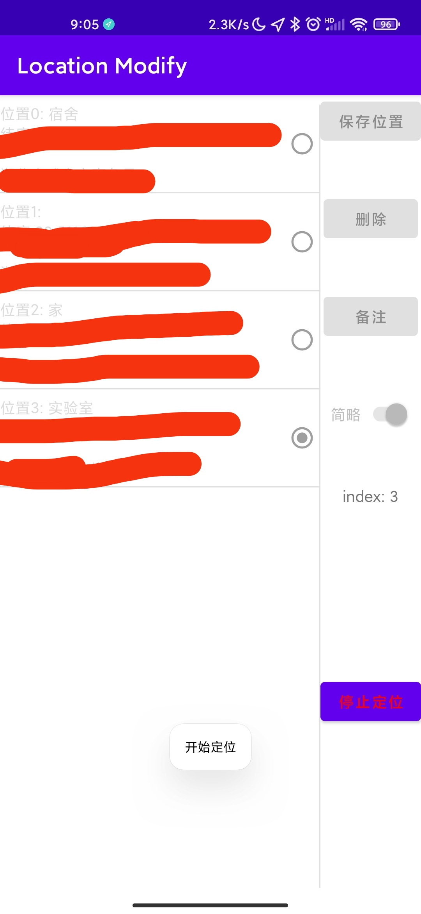

# locationModify
自用，root级的定位修改，基于位置复现，操作方便。需要Xposed框架支持(magisk+EdXposed)。 
# UI

 

 

# TODO
1. 若开始定位后，在控制台强行kill进程，定位会一直进行，除非再次打开程序。
    - 原因是修改定位会运行在xposed进程下，主程序只负责修改配置，强行kill程序会导致没有把配置变为停止
    - 考虑后续添加服务处理这一情况，也不知道行不行
2. 封装文件读写代码
3. 添加地图遥感保存位置功能
    - 保存位置现在够用了，要模拟没去过的位置的时候再加